<h1 align="center">Create a dashboard with AWS S3 and Quicksight</h1>
  

<B>PRE-REQUISITES</B>
  <br>

To complete this project, you will need the following: <br>
- AWS Account<br>
- IAM S3 Policy Attached to Your User<br>

<B>Step 1 — Login to your AWS console</B>
 <p align="center">
  
</p>

<b>Step 2 — Navigate to S3</b>
 <p align="center">
  
</p>
<b>Step 3 - Click on Create Bucket</b>

- Enter Bucket Name<br>

- Select your Region<br>
  
- leave the rest to default and click Create Bucket<br>

<b>step 4 - upload Content</b>
- Replace your Bucket Name in the manifest.json file<br>
<p align="center">
  
</p>
<b> Step 5 -  Add bucket Policy</b> <br>

```diff
{
  "Version": "2012-10-17",
  "Statement": [
      {
          "Sid": "AllowQuickSightAccess",
          "Effect": "Allow",
          "Principal": {
              "Service": "quicksight.amazonaws.com"
          },
          "Action": [
              "s3:GetObject",
              "s3:ListBucket"
          ],
          "Resource": [
              "arn:aws:s3:::your-bucket-name",
              "arn:aws:s3:::your-bucket-name/*"
          ]
      }
  ]
}
```
<br>
- <b> Remember to replace your Bucket Name in "arn:aws:s3:::your-bucket-name",
  "arn:aws:s3:::your-bucket-name/*" </b><br>
  
  <b>Step 6 - Open Quicksight in a new Tab</b><br>
  <p align="center">
    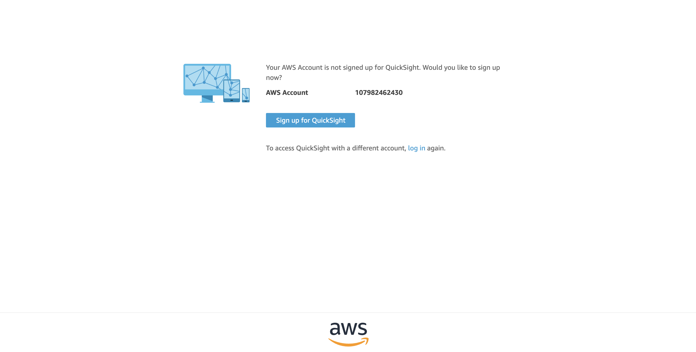
  </p>
  - Sign up for free trial <br>
  <p align="center">
    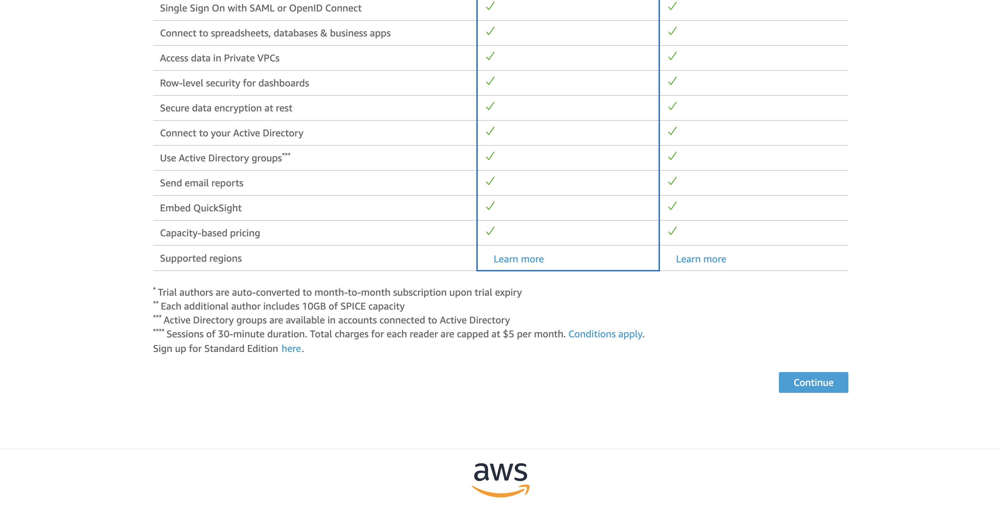
  </p>
  - Enter you Details<br>
  <p align="center">
    
  </p>
  - Enable IAM and S3 Roles<br>
  <p align="center">
    
  </p>

  <b>step 7 - Quicksight Dashborad</b>
  <p align="center">
    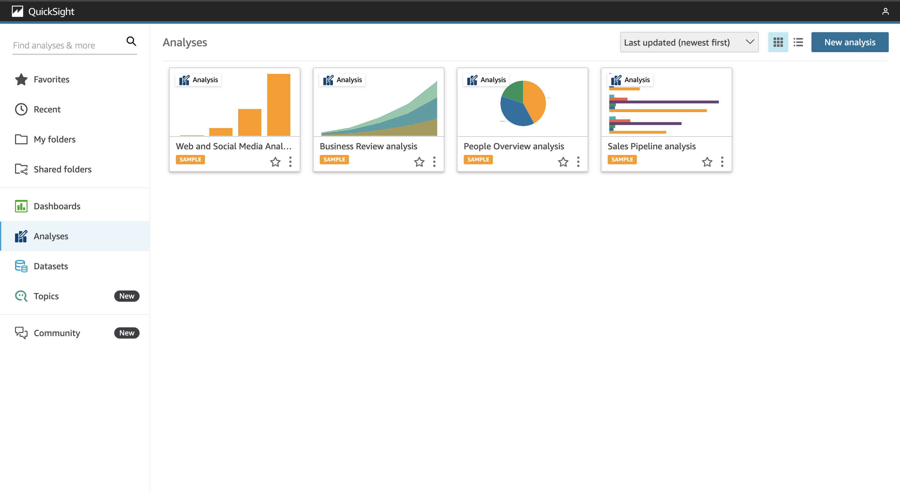
  </p>
  - Navigate to datasets<br>
  <p align="center">
    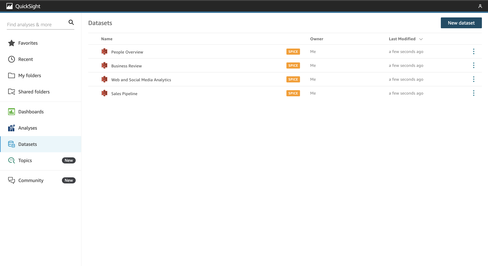
  </p>
  - Click on S3<br>
  <p align="center">
    
  </p>
  - Visulize <br>
  <p align="center">
    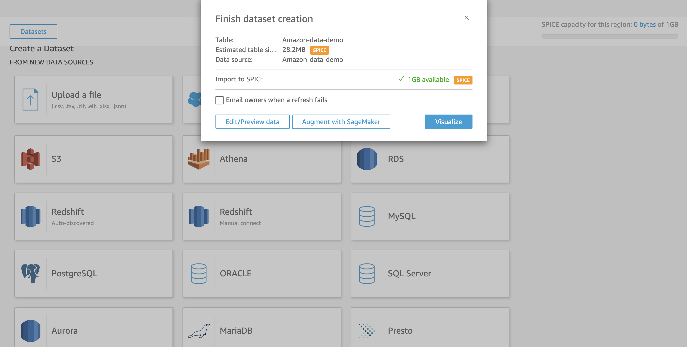
  </p>
  - Interactive Sheet<br>
  <p align="center">
    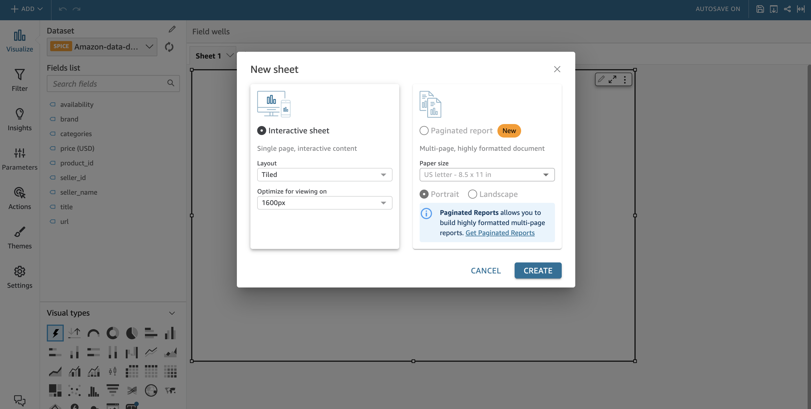
  </p>
  - Drag brand into sheet 1
  <p align="center">
    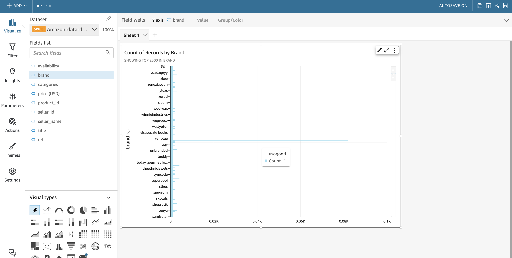
  </p>
  - Sort the data based on your metric<br>
  <p align="center">
    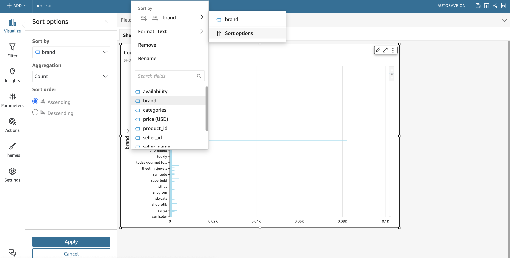
  </p>
  - I am sorting the data to find the highest-selling brand <br>
  <p align="center">
    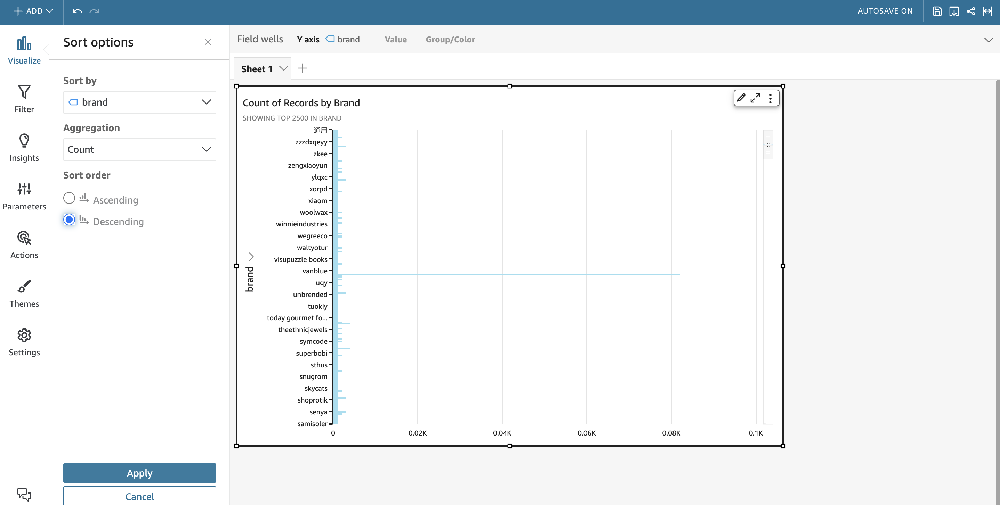
  </p>
  - Play around to create the optimal dashboard <br>
  <b>Step 8 - Remember to Cleanup to avoid charges</b>
  - Click the top right icon, select manage quicksight<br>
  <p align="center">
    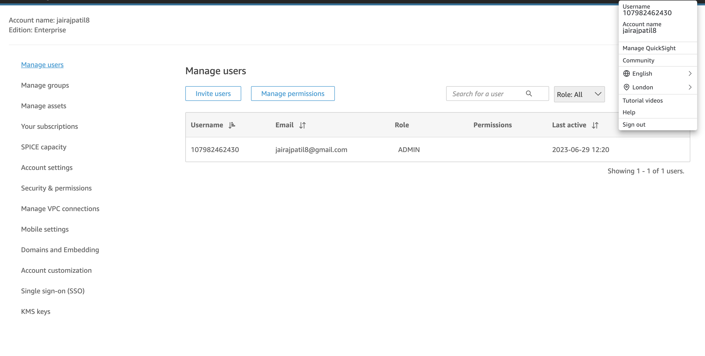
  </p>
  - Account Settings, Account Termination <br>
  <p align="center">
    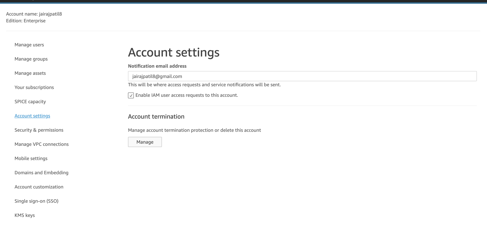
  </p>
 - confirm<br>


  


  
